The goal of this project is to understand how a basic graphics pipeline works internally by implementing the major rendering steps without relying on a GPU rendering API.

This project is intentionally small and educational rather than production-ready. It focuses on learning how pixels, geometry, transformations, rasterization, depth testing, textures, and lighting come together to produce a 3D image.

📺 Built Live on Stream
Built this software renderer live on stream from scratch 70% is in the stream, exploring the rendering pipeline step by step.
🎥 [Watch the stream on YouTube](https://www.youtube.com/@devNobu/playlists)

1. Framebuffer + Pixel Output

A software framebuffer for storing and directly manipulating individual pixels.

2. Line Rasterization

Rasterizes lines directly onto the framebuffer using software-based algorithms.

3. Triangle Rasterization

Fills and rasterizes triangles by determining which pixels lie inside the triangle.

4. Vector / Matrix Transformations

Implements vector and matrix operations for transforming 2D and 3D geometry.

5. Perspective Projection

Projects 3D geometry onto a 2D screen with realistic perspective.

6. Depth Buffer

Uses a depth buffer to determine which surfaces are visible when geometry overlaps.

7. Texture Mapping

Maps 2D textures onto 3D geometry using UV coordinates.

8. Perspective-Correct Interpolation

Correctly interpolates texture coordinates and other vertex attributes across projected triangles.

9. Basic Lighting

Applies basic lighting calculations to produce simple shading on 3D surfaces.

10. Load and Render a Real 3D Model

Loads and renders a real 3D model through the software rendering pipeline.

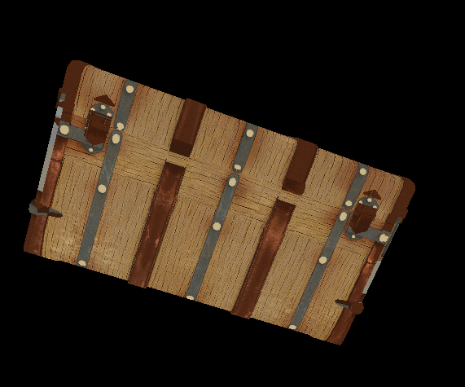
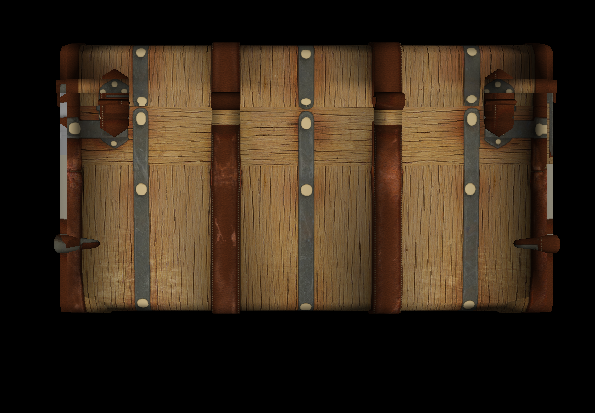
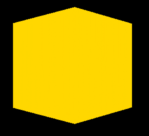
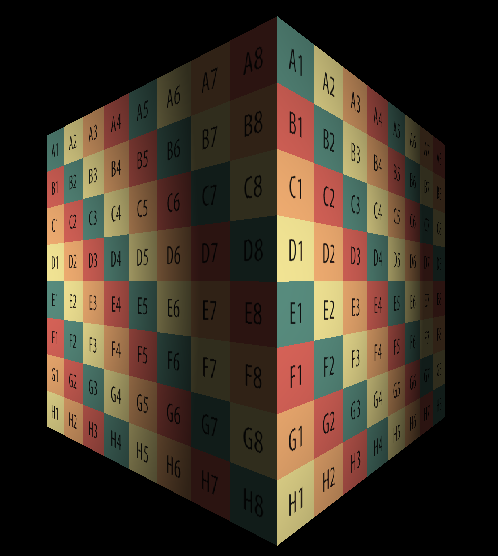
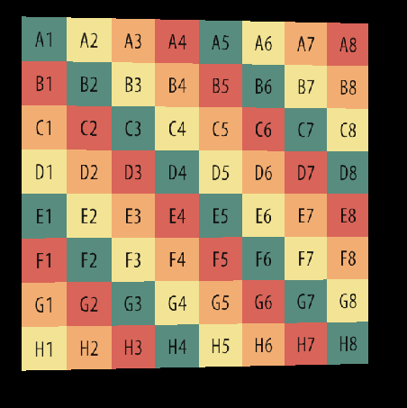
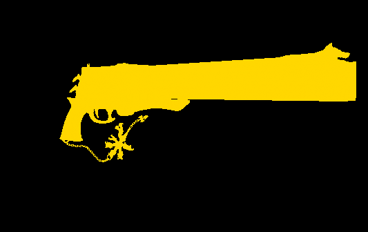
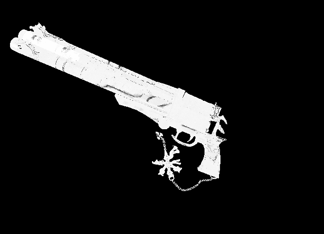
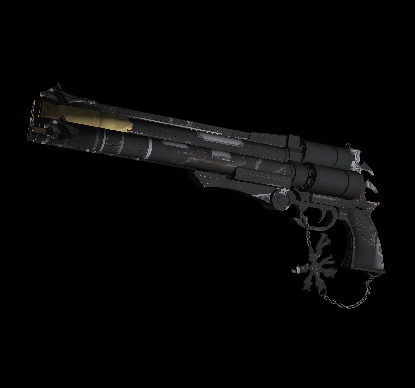
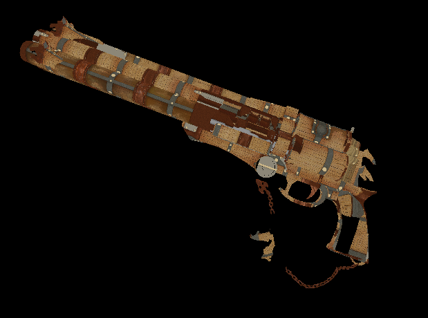
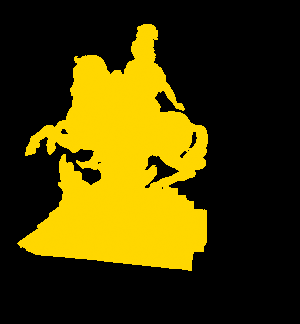
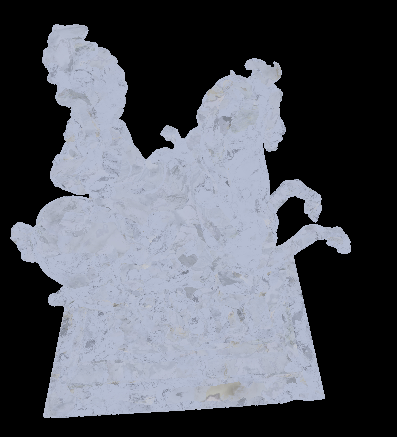
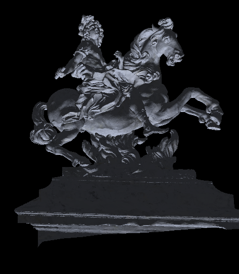

